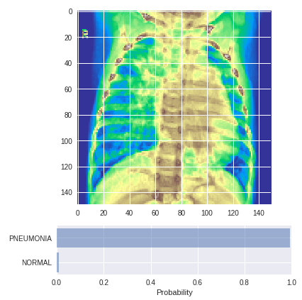

# Detecting Children Pneumonia from Chest X-ray images

This project was created as a Capstone project for my Machine Learning Engineer Nanodegree.

## Problem Statement
Pneumonia is the single largest infectious cause of death of children worldwide. This disease is accounting for 16% of all deaths under the age of five (which meant 920 136 children in 2015). Pneumonia is most prevalent in South Asia and sub-Saharan Africa but it is present all over the world. It can be treated with low-cost, low-tech medication and care if it is diagnosed in time. (World Health Organization, 2016)

My project’s aim is to build a base for a Clinical Decision Support Systems (CDSS) for radiologists to help diagnose Pneumonia easier, quicker and more accurately from children’s chest X-Ray images. 
My intention is to create a model that might be implemented into a software or a webpage through an API.

## Dataset
The dataset used for the whole modelling process can be found [here.](https://www.kaggle.com/paultimothymooney/chest-xray-pneumonia/data)

## Resources

**Path**|**Description**|**Comment**
:-----|:-----|:-----
/01_data_analysis.ipynb|Descriptive analysis of the datasets.| developed on local machine
/02_image_coloring.ipynb|Applying colormaps on black & white images.| developed on local machine
/03_image_augmentation.ipynb|Image Augmentation |developed on local machine
/04_modelling_colab.ipynb|Training and testing different models.|developed on Colaboratory
/05_testing_colab.ipynb|Testing the final model on a few random images.|developed on Colaboratory
/best_weights_inception_100.h5|Weights of the best model | - 
/Detecting_Children_Pneumonia_From_ChestXray.pdf|Report on 'Detecting Children Pneumonia from X-ray Images'| - 

## Results

The best model’s performance on the test set plotted with confusion matrix:

Test results on random images of Pneumonia (left) and Normal (right):

 

<!--stackedit_data:
eyJoaXN0b3J5IjpbMTUzMzc3MjE4NCwtMTYxMDI5MDY0NiwtNT
kxMzgxMDY4LDkyODE5MzAwNCwtNjY5MDExMTQzLC0zMjU3NjE5
NTZdfQ==
-->